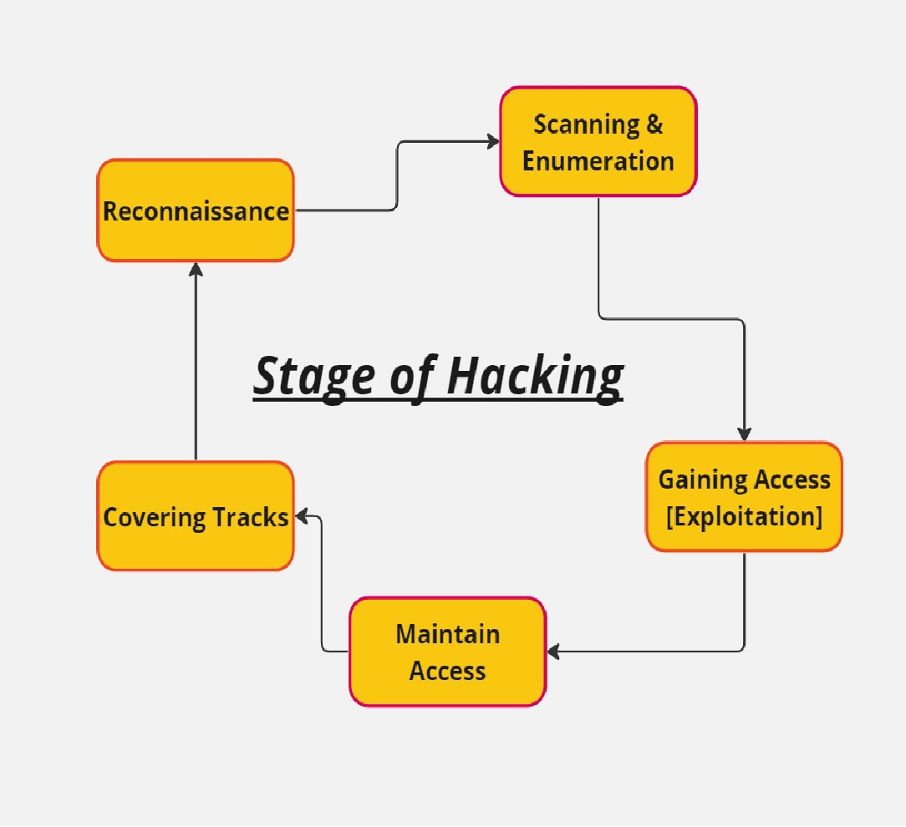

# The Begining of Hacking !!!
---

# ***What and Why is Hacking***

Opinions: **breaking any process, any misconfiguration or loopholes to use for benefits is hacking**

Opinions: **unauthorized access to entity using loopholes is hacking**

## ***Hasan Opinions:***

>  1.Applying ingenuity to create clever results.

> 2.Why I am doing hacking because I will be the going to become the ones who understand the internet like the attackers, I saw this system for what is was a network worth protecting.

>  3.Hacking is often thought of in negative terms, like the image of someone in a basement wearing a black hoodie typing on a computer, and trying to hack into the NSA. But this stereotype is wrong. Hacking can be done in different ways from mischievous individuals seeking attention to practical purposes like testing security or analyzing vulnerabilities. The main goal of hacking is to find weaknesses and try to exploit them.

- Example: building is built and need to check how long the build last, check form general check team they can do anything to test the building quality like break with hammer, using acid anything.
-  In CyberSecurity company hired hacker to break the entity because they know if this hired hacker can do then outsider hacker can also do.
-  The best way to prevent hacking is to perform hacking

---

##  ***Different NAME from REDTEAM Side:***

**Hackers** : Hacker will perform the unauthorized access to entity.

**Crackers** : It’s the one who utilizes the unauthorized access to damage the entitle.

**Script Kidde** : They don’t have the in-depend knowledge of script, like using someone else tool to perform hacking is a part of script kidding. These individuals use pre-written scripts or tools to hack into systems, often without understanding how they work.  including ME:(

---

## ***Different Types Of Hackers***

**BlackHats Hackers**: If a hacker found any bug etc. then it will be not going to report it because the Blackhat hacker has a motive to get the benefits on it whatever the entity and utilizes to their own benefits.
These individuals engage in illegal hacking activities, often for personal gain or to cause harm.

**WhiteHats hackers**: If hacker found any bug etc. then it will be reported because the Whitehat hacker has a goal to secure whatever the entity.
Also known as ethical hackers, these individuals use their hacking skills for defensive purposes, such as testing an organization's security systems to identify vulnerabilities that need to be fixed.

**Grey Hats Hackers**: it’s the mixer of both. These individuals may sometimes engage in illegal hacking activities, but also use their skills for defensive purposes.

**Blue Hat Hackers**: These individuals are not professional hackers, but may engage in hacking as a hobby or to test their own systems or networks

---

## ***CIA Triad***

**_Confidentiality_**: Data should not be shared with unauthorized.

**_Integrity_**: Data should not tamper or be known as hashing.

**_Availability_**: Data/anything should be available when needed.

---

## ***Phase Of Hacking***

**Phase of hacking is the umbrella/Tree of hacking activity.**

**_Information Gathering_**: It is the most important part/ crucial initial phase in hacking.

**_Active information_****:** Gathering when the target/entity is aware that their information is being gathered.

**_Passive_** **_information_**: Gathering when the target/entity is unaware that their information is being gathered.

>**_Note: In this part all the process of hacking depends on and the exits points._**

**_Scanning_**: Validating information obtained through information Gathering. During scanning, it helps in gaining access to the entity.

**_Gaining access_**: Successfully compromising the targeted/entity, indicating a successful hacking attempt.

**_Maintaing access_**: After some time, the entity will attempt to validate and clean up the compromised system, while aiming for long-term access.

**_Clearing tracks and reporting_**:
-  _Reporting: the documents the vulnerabilities, methods used, and potential impact. They then present the findings to relevant parties, explain the vulnerabilities clearly, and provide Solutions recommendations.._ _Reporting helps the organizations to identify and address vulnerabilities, improving their security and protecting sensitive data._

---

## ***Penetration Testing***

### **_WHAT & WHY is Penetration Testing:_**

**_Penetration Testing_**: The term "**penetration**" refers to the act of penetrating and validating the security of a system.

Pen tester and penetration tester are professionals who are responsible for conducting these tests on the entities

During penetration testing, the testers actively attempt to penetrate the system and identify potential loopholes or vulnerabilities.

The goal of penetration testing is to uncover weaknesses in the system's defenses by simulating real-world attack scenarios and finding exploitable areas.

**Methodologies** means **_roads_**.

**_Whitebox testing_**: The tester possesses knowledge about the target entity and has access to internal resources, allowing for a more comprehensive evaluation. They know the target/entity and have access to penetrate the system.

**_Blackbox testing_**: The tester lacks prior knowledge about the entity and has no access to internal information, replicating an external attacker's perspective. They don't know anything about the entity and have no access to form the entity's side. It involves blind testing with zero knowledge of the entity.

**_Grey box testing_**: This approach combines elements of both Whitebox and Blackbox testing. The tester has limited knowledge or partial access to certain aspects of the entity. It falls between the two extremes, providing some level of insider knowledge without full access.

>**_Example:_**
>
>_In the case of application security testing, the entity launches an application and hires a **Whitebox tester** to >identify vulnerabilities in the source code, leveraging the provided access to the source code._
>
>_For assessing the login/sign-in pages of the application, the entity hires a **grey box tester** who is given login/sign-in credentials. The tester evaluates potential loopholes specifically related to the login/sign-in functionality. using partial knowledge of the system._
>
>_In the scenario involving both login/sign-in and the application's source code, the entity hires a **Blackbox tester** who has no prior information or access from the entity's side. The tester's objective is to identify vulnerabilities without any insider knowledge or access._
>
>_All these **testing methodologies** are reported and aim to assess the potential damage an entity may incur when subjected to actual hacking attempts, helping identify and fix the issue_.

---

## ***Stages Of Hacking***

***Its Starts with Reconnaissances --> Scanning & Enumeration --> Gaining Access --> Maintaining the Access --> Covering Tracks.. ***

>Sometimes because of human error and more. repeat this process as many times as want..

**_Planning and Reconnaissance_** 
- **_Active vs Passive_**
	- _This stage involves mapping out the target network or system, identifying any potential vulnerabilities, and assessing the potential impact of an attack_

**Scanning and Enumeration**
- **_Nmap_**
	- _This stage involves using a variety of tools and techniques to identify potential entry points, such as open ports or services that may be vulnerable to exploitation._

**Gaining Access**
- **_Exploitation_**
	- _This stage involves leveraging the identified vulnerabilities to gain access to the target system or network. Once access has been gained_

**Post Exploit**
- **_Maintain Access_**
	- _This stage involves conducting further reconnaissance, escalating privileges, and maintaining access to the target system or network._

**CoveringTracks**
- **_Reporting and Remediation_**
	- _This stage involves compiling a detailed report of the findings, including any identified vulnerabilities, the impact of the vulnerabilities, and recommended mitigation measures. It is important to follow a structured process such as this to ensure that all relevant areas are covered and that appropriate mitigation measures are put in place._

---

